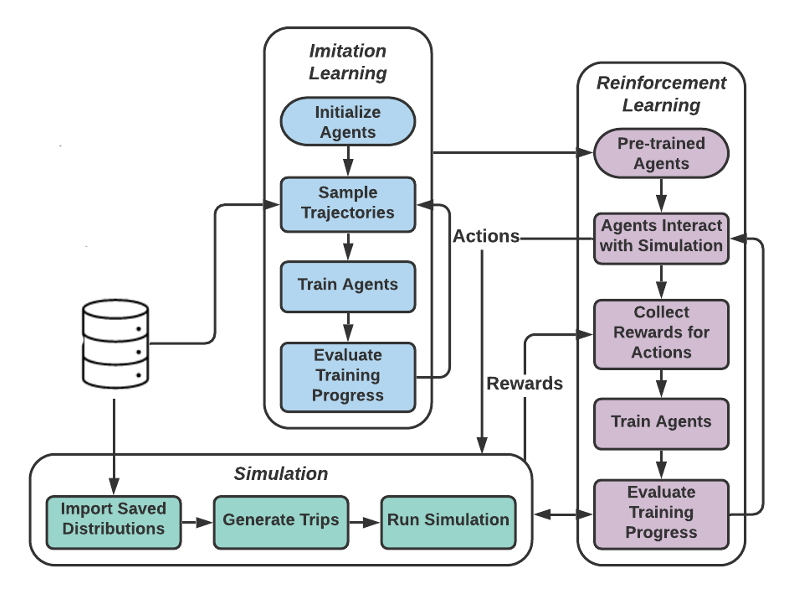
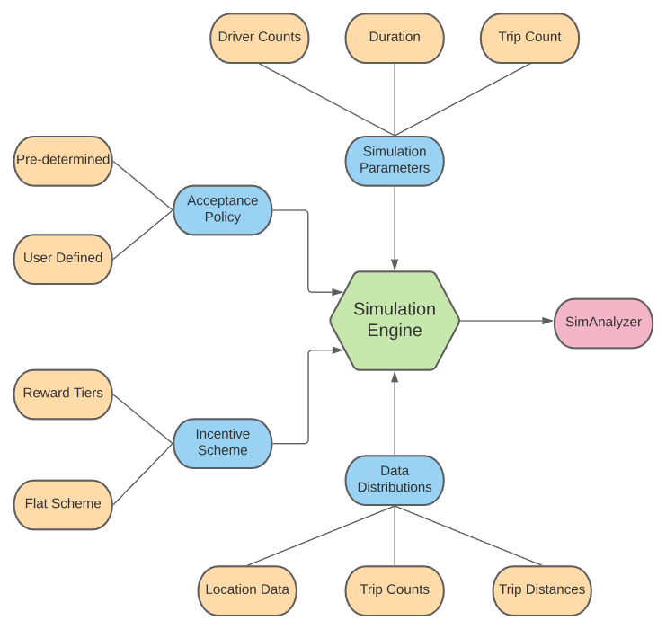
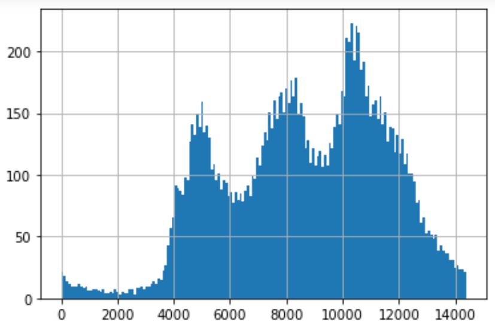
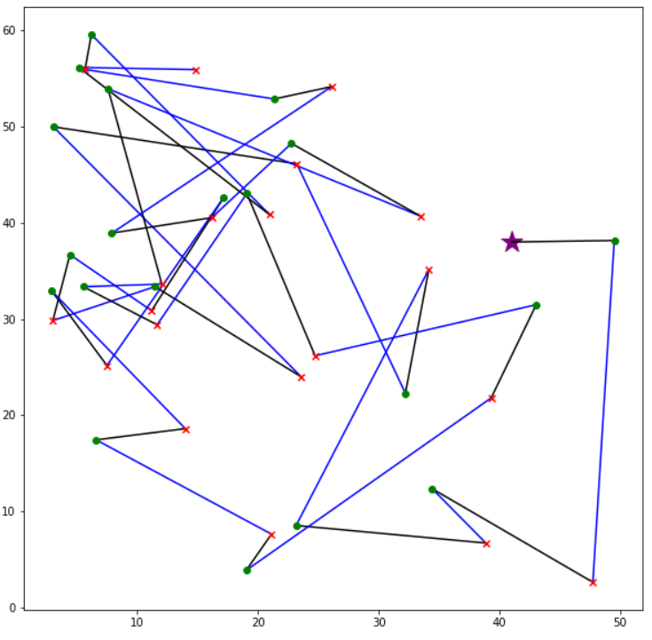

# RHail: Simulation Framework for Modeling Ride Hailing Platforms
### Introduction
The rapid growth of ride-hailing platforms has created a highly competitive market where businesses struggle to make profits, necessitating better operational strategies. However, real-world experiments are risky and expensive for these platforms as they deal with millions of users daily. Thus, a need arises for a simulated environment where one can predict users' reactions to changes in the platform. Building such a simulation is challenging, as these platforms exist in dynamic environments where thousands of agents regularly interact with one another. This paper presents a framework to mimic and predict driver behaviors in ride-hailing services. We use a data-driven hybrid reinforcement learning and imitation learning approach for this. First, the agent utilizes behavioral cloning to mimic driver behavior from a real-world data-set. Next, reinforcement learning is applied to the pre-trained agents in a simulated environment, to allow them to adapt to changes in the platform. Our framework provides an ideal playground for ride-hailing platforms to experiment with platform-specific parameters such as trip fares and incentives to predict the drivers’ behavioral patterns. 

### System Overview

System consists of a simulation engine, and two learning phases.



### Simulation Engine Overview



### Requirements
```Python 3+
commandline
numpy
simpy
pandas
matplotlib
tensorflow
tqdm
TFAgents
```

### Getting Started
Add the current directory to the path variable list of python.
```python
import os,sys
from pathlib import Path
sys.path.insert(1, os.path.join(sys.path[0], Path(os.getcwd()).parent))
```

To check whether all modules are properly imported run the simulation with default parameters.

```python
from RideSimulator.taxi_sim import run_simulation 
states, analyzer = run_simulation()
```
You should see the following output if there are no any errors. The number of trips might not exactly match due to the 
randomness of the simulation.

The `run_simulation()` method returns the states of the driver actions alongside with a `SimAnalyzer` object which can 
be used to evaluate the simulation.

``` commandline
Using random policy
The Simulation will run for 1.0 weeks, 0.0 days, 0.0 hours.

Number of trips generated: 1841
```

The default parameters can be changed by passing a dictionary with updated values.
```python
new_params = {
    "TRIPS_PER_WEEK":4000, 
    "NUM_DAYS":2, 
    "DRIVER_COUNT":25, 
    "GRID_WIDTH":60,
    "GRID_HEIGHT":60,
    "HEX_AREA":5
}
update_parameters(new_params)

states, analyzer = run_simulation(progress_bar=True)
```
In addition to the parameters the distributions that are used to generate the trips can also be specified by the user.
```python
read_data(directory="data",lon_file="lon_points", lat_file="lat_points", 
          distance_file="trip_distances", min_file="trips_per_min")
```
The user also has the ability to change the default reward parameters or to define a new method of calculating weekly 
rewards and the reward progression mechanism by overriding the methods in the `reward_parameters.py` file. 

```python
from RideSimulator import reward_parameters

reward_parameters.unit_reward = 15
reward_parameters.base_reward = 5000
```

### Sim Analyzer
This class can be used to analyze the outcomes of the simulation. It keeps track of all actions taken by the drivers 
during the simulation along with the trips that were generated. After each simulation run, the `run_simulation()` 
method will return a `SimAnalyzer` object that can be used to investigate the run.

```commandline
>>> analyzer.get_completed_trips()
2610
>>> analyzer.completed_percentage()
0.950819
```
You can also visualize the distribution of trips generated by the simulation across time.
```python
analyzer.trip_distribution()
```


The movement of a driver during the simulation can also be visualized. The starting location of the driver is shown by a star.
```python
analyzer.plot_driver_movement(driver_id=1,number_of_trips=20,first_trip=0)
```

### Directory Structure
Overall directory structure of the simulation framework.

    ├── RideSimulator
        ├── data
            ├── lat_points : Sampled distribution of latitude points
            ├── lon_points : Sampled distribution of longitude points
            ├── trip_distances : Sampled distribution of trip distances
            ├── trips_per_min : Sampled distribution of numbe of trips per min
        ├── Driver.py : Driver class representing the structure of the agent and logic
        ├── Grid.py : Grid class handling location related functionalities 
        ├── HexGrid.py : Overlay on grid to 
        ├── HexTile.py : 
        ├── reward_parameters.py : 
        ├── sim_analyzer.py : 
        ├── State.py :
        ├── taxi_sim.py :
        ├── Trip.py :
        └── TripGenerator.py :
